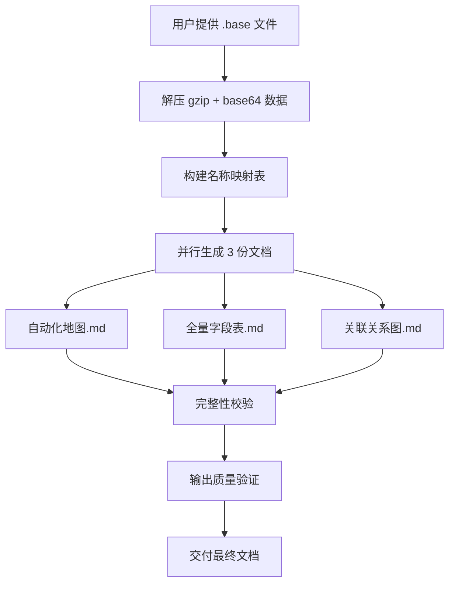
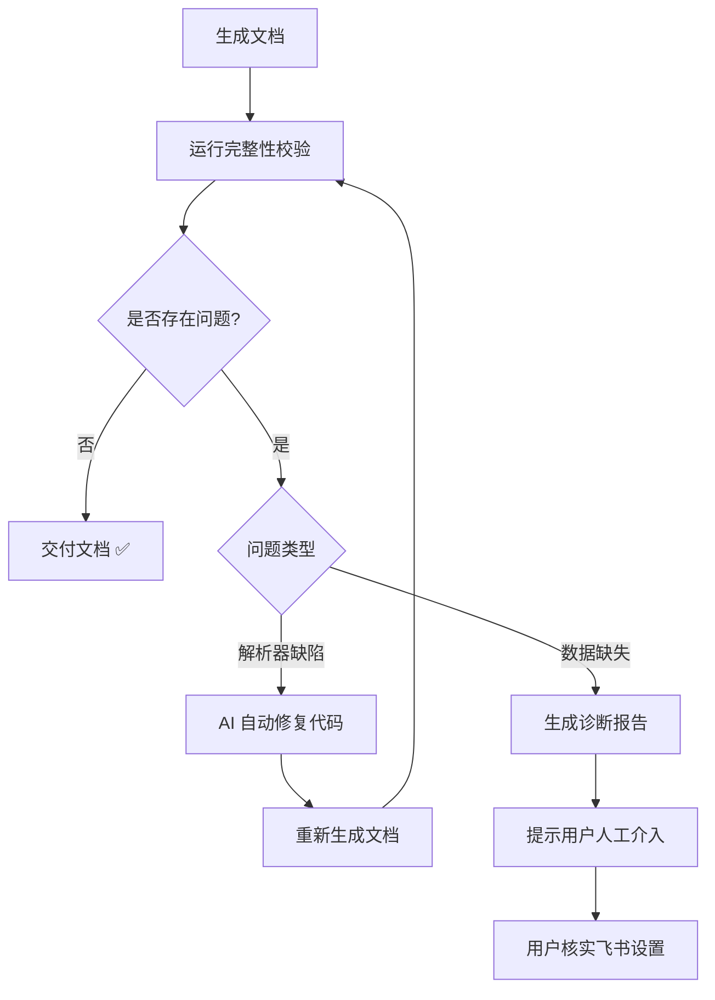

# 飞书多维表格解析器 Skill 技术架构

> 版本: 1.0  
> 文档目的: 在打包为 Skill 之前，完整梳理技术流程、工具链、输出规范和扩展性策略

---

## 1. Skill 概述

### 1.1 功能定位
将飞书多维表格的 `.base` 导出文件解析为**人类和 AI 都能理解**的系统文档，无需打开飞书即可完整理解：
- 表结构和字段定义
- 自动化工作流逻辑
- 表与表之间的关联关系

### 1.2 使用场景
| 场景 | 说明 |
|------|------|
| **系统交接** | 新团队成员快速理解复杂的多维表格系统 |
| **AI 对话** | 将文档作为上下文，让 AI 回答业务逻辑问题 |
| **技术审计** | 检查工作流完整性、字段依赖关系 |
| **迁移评估** | 评估将系统迁移到其他平台的工作量 |

---

## 2. 工作流程



### 2.1 详细步骤

| 步骤 | 输入 | 处理 | 输出 |
|------|------|------|------|
| 1. 解压 | `.base` JSON 文件 | 解码 gzip + base64 | 原始数据结构 |
| 2. 构建映射 | 原始数据 | 提取表名/字段名/选项名 | `table_map`, `field_map`, `option_map` |
| 3. 生成文档 | 映射表 + 原始数据 | 翻译 ID → 名称，格式化 Markdown | 3 份 `.md` 文档 |
| 4. 完整性校验 | 生成的文档 + 原始数据 | 检测未解析字段 | 校验报告 |

---

## 3. 核心脚本

### 3.1 脚本清单

| 脚本名 | 用途 | 输出文件 |
|--------|------|----------|
| `generate_自动化地图.py` | 解析所有自动化工作流 | `自动化地图.md` |
| `generate_readable_schema.py` | 解析表结构和字段定义 | `全量字段表.md` |
| `generate_关联关系图.py` | 解析跨表关联关系 | `关联关系图.md` |
| `completeness_checker.py` | 校验解析完整性 | `完整性校验报告.md` |

### 3.2 脚本依赖关系

```
generate_自动化地图.py
├── 依赖标准库: json, base64, gzip, io, re, datetime
├── 无外部依赖
└── 独立运行

generate_readable_schema.py
├── 依赖标准库: json, base64, gzip, io, re, datetime
└── 独立运行

generate_关联关系图.py
├── 依赖标准库: json, base64, gzip, io, re, datetime
└── 独立运行

completeness_checker.py
├── 依赖: 上述 3 个脚本必须先运行
└── 对比原始数据 vs 生成文档
```

---

## 4. 输出文档规范

### 4.1 自动化地图.md

**包含内容**:
- 工作流名称、状态（启用/停用）
- 触发条件（定时/记录变更/按钮点击）
- 触发筛选条件（字段条件表达式）
- 每个步骤的详细逻辑
- 条件分支判断
- 循环逻辑

**质量要求**:
- ✅ 所有字段 ID 翻译为中文名
- ✅ 所有操作符翻译为中文
- ✅ 步骤引用显示具体字段 `[步骤2的「面料编号」]`
- ❌ 不允许出现原始 ID 或英文操作符

### 4.2 全量字段表.md

**包含内容**:
- 每张表的字段清单
- 字段类型（文本/数字/公式等）
- 公式解析（ID 翻译为名称）
- 视图筛选逻辑

**质量要求**:
- ✅ 字段类型为中文（不是数字）
- ✅ 公式中的 ID 全部翻译
- ✅ 选项值完整展示

### 4.3 关联关系图.md

**包含内容**:
- 跨表关联字段
- 关联类型（公式关联/查找引用/选项同步）
- 筛选条件解析
- 完整公式展示

---

## 5. 翻译字典

### 5.1 字段类型 (FIELD_TYPES)

```python
FIELD_TYPES = {
    1: "文本", 2: "数字", 3: "单选", 4: "多选", 5: "日期",
    7: "复选框", 11: "人员", 13: "电话", 15: "超链接", 17: "附件",
    18: "关联", 19: "查找引用", 20: "公式", 21: "双向关联",
    22: "地理位置", 23: "群组",
    1001: "创建时间", 1002: "修改时间", 1003: "创建人", 1004: "修改人",
    1005: "自动编号", 3001: "按钮"
}
```

### 5.2 操作符 (OPERATORS)

```python
OPERATORS = {
    "is": "等于", "isNot": "不等于", "contains": "包含",
    "isEmpty": "为空", "isNotEmpty": "不为空",
    "isGreater": "大于", "isLess": "小于",
    "isGreaterEqual": "大于等于", "isLessEqual": "小于等于",
    # ... 更多
}
```

### 5.3 动作类型 (ACTION_TYPES)

```python
ACTION_TYPES = {
    "FindRecordAction": "查找记录",
    "AddRecordAction": "新增记录",
    "UpdateRecordAction": "修改记录",
    "IfElseBranch": "条件判断（If/Else）",
    "Loop": "循环",
    # ... 更多
}
```

---

## 6. 扩展性策略

> **核心问题**: 当解析新的 `.base` 文件时，可能遇到当前解析器未覆盖的字段、类型或结构

### 6.1 三层容错机制

```
第一层: 翻译字典未命中
├── 策略: 保留原始值并标记
├── 示例: FIELD_TYPES.get(type_id, f"未知类型({type_id})")
└── 效果: 不会报错，但会在文档中暴露未知类型

第二层: 结构解析失败
├── 策略: try-except 包裹并记录警告
├── 示例: 新的步骤类型会显示原始数据
└── 效果: 文档可生成，未解析部分原样输出

第三层: 完整性校验报告
├── 策略: 对比原始字段 vs 已解析字段
├── 示例: completeness_checker.py 输出差异报告
└── 效果: 明确告知用户哪些内容未被解析
```

### 6.2 检测未覆盖字段的方法

1. **processed_keys 机制**
   ```python
   processed_keys = set()
   # 每处理一个字段就加入集合
   processed_keys.add('fieldName')
   
   # 最后检查未处理的字段
   unprocessed = set(step_data.keys()) - processed_keys
   if unprocessed:
       lines.append(f"⚠️ 未处理字段: {unprocessed}")
   ```

2. **翻译失败标记**
   - 字段名未解析: 保留原始 `fldXXXX` 格式
   - 表名未解析: 保留原始 `tblXXXX` 格式
   - 运算符未翻译: 保留原始 `isGreaterEqual` 等

3. **完整性校验脚本**
   - 自动检测所有未翻译的 ID
   - 生成 `完整性校验报告.md`

### 6.3 自动化自愈与诊断流程



#### 流程说明
1. **自动闭环**：对于代码层面的解析缺陷（如未翻译的 ID），AI 会自动修改生成脚本并重试，用户无感知。
2. **明确边界**：对于数据层面的缺失（如字段被删除），系统不会尝试"猜"或"编"，而是明确报告 `[未知字段:ID]`。
3. **行动指南**：校验报告提供精确的定位（表名/行名/链接）和具体的操作步骤（查红字/截图）。

### 6.4 新增字段类型的操作示例

假设发现 `type=25` 未被识别：

```python
# 1. 在 FIELD_TYPES 中添加
FIELD_TYPES[25] = "评分"  # 根据飞书实际类型名称

# 2. 重新运行脚本
python3 generate_readable_schema.py

# 3. 验证输出
```

### 6.5 新增步骤类型的操作示例

假设发现 `SendEmailAction` 未被处理：

```python
# 1. 添加到 ACTION_TYPES
ACTION_TYPES["SendEmailAction"] = "发送邮件"

# 2. 在 parse_step 函数中添加处理逻辑
if step_type == 'SendEmailAction':
    recipient = step_data.get('recipient')
    subject = step_data.get('subject')
    lines.append(f"{indent}  - 收件人: {recipient}")
    lines.append(f"{indent}  - 主题: {subject}")
    processed_keys.update(['recipient', 'subject'])
```

---

## 7. Skill 使用指南

### 7.1 基本用法

```
用户: 请帮我解析这个飞书多维表格
AI: 收到，请提供 .base 文件
[用户上传文件]
AI: 
1. 运行 generate_自动化地图.py
2. 运行 generate_readable_schema.py  
3. 运行 generate_关联关系图.py
4. 运行 completeness_checker.py
5. 输出 4 份文档供查阅
```

### 7.2 触发短语

- "解析飞书多维表格"
- "帮我梳理这个多维表格的逻辑"
- "分析这个多维表格的自动化流程"
- "把这个多维表格的业务逻辑给我梳理出来"

### 7.3 输出交付物

| 文件 | 大小参考 | 用途 |
|------|----------|------|
| 自动化地图.md | 80KB+ | 理解业务逻辑 |
| 全量字段表.md | 50KB+ | 理解数据模型 |
| 关联关系图.md | 15KB+ | 理解表间依赖 |
| 完整性校验报告.md | 3KB | 质量验证 |

---

## 8. 已知限制

| 限制 | 说明 | 缓解措施 |
|------|------|----------|
| 依赖导出文件 | 需要用户手动导出 .base | 无法自动获取 |
| ID 解析失败 | 部分工作流内部 ref_XXX 格式无法解析 | 保留原始 ID |
| 未来版本兼容 | 飞书更新可能引入新结构 | 使用容错机制 |
| 大文件性能 | 超大表格可能解析较慢 | 无优化 |

---

## 9. 文件结构

```
feishu-base-parser/
├── scripts/
│   ├── generate_自动化地图.py      # 核心脚本
│   ├── generate_readable_schema.py  # 核心脚本
│   ├── generate_关联关系图.py       # 核心脚本
│   └── completeness_checker.py      # 校验脚本
├── output/                           # 用户运行后生成
│   ├── 自动化地图.md
│   ├── 全量字段表.md
│   ├── 关联关系图.md
│   └── 完整性校验报告.md
├── 输出质量标准.md                   # 质量规范
└── SKILL.md                          # Skill 入口文件
```

---

## 10. 下一步

- [ ] 确认架构文档无误
- [ ] 创建 SKILL.md 入口文件
- [ ] 组织文件结构
- [ ] 测试 Skill 完整流程
